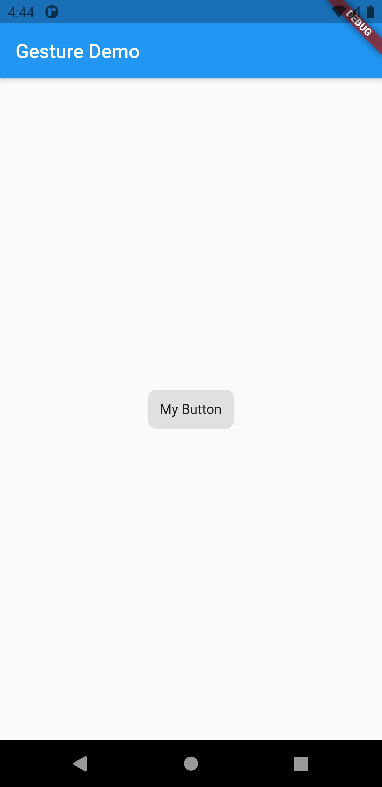
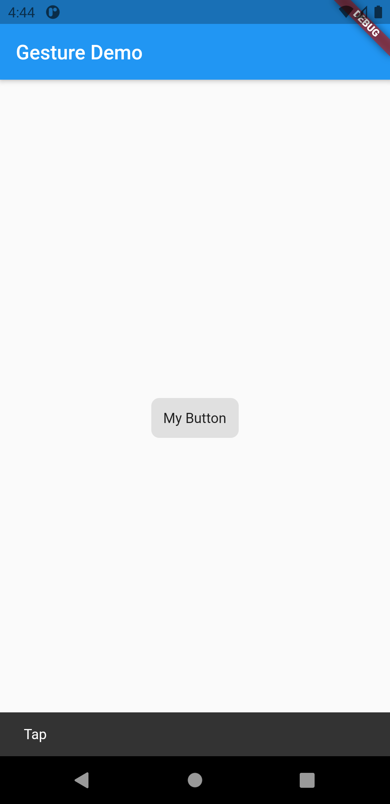

# handle_taps

You not only want to display information to users, you want users to interact with your app. Use the GestureDetector widget to respond to fundamental actions, such as tapping and dragging.

<table>
  <tr>
    <td>Button</td>
     <td>Tapped</td>
  </tr>
  <tr>
    <td></td>
    <td></td>
 
  </tr>
 </table>
